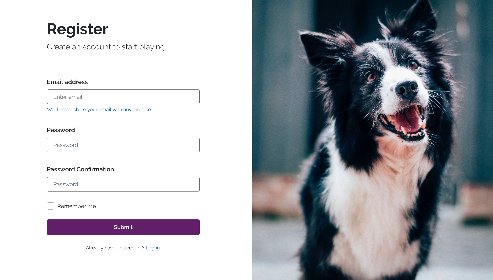
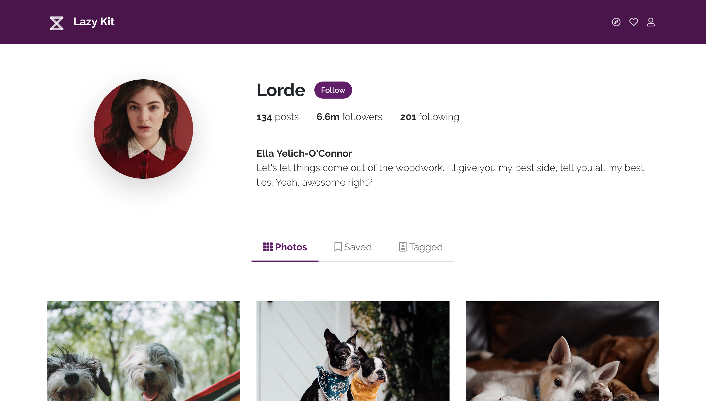
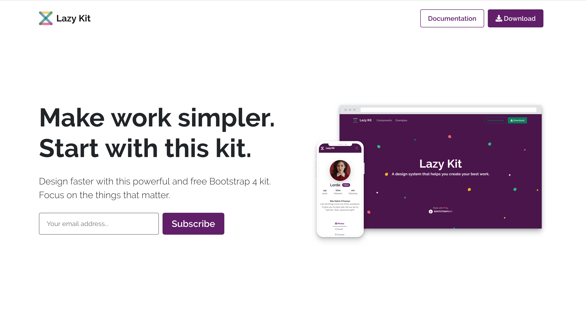

<b>Lazy Kit</b> is a complete design system built with React.JS and Reactstrap.  
It is created for all web makers that want to get a project off the ground quickly and neatly.  
It overwrites the styles for the Reactstrap components and adds 2 more plugins. It also comes with 3 example pages.

  <a href="https://bootstrapbay.github.io/lazy-kit-react/">Components</a> •
  <a href="https://bootstrapbay.github.io/lazy-kit-react/documentation">Documentation</a> •
  <a href="#">Official Page</a>

 

## Download

* [From GitHub](https://github.com/bootstrapbay/lazy-kit-react)
* [From BootstrapBay](https://bootstrapbay.com/theme/lazy-free-react-ui-kit-BD90DEB)
 

## Examples
Lazy Kit comes with 3 examples that show you what you can build with it.

|  |  | |
| ------------- |:-------------:| -----:       |
| [Register Page](https://bootstrapbay.github.io/lazy-kit-react/register) | [Profile Page](https://bootstrapbay.github.io/lazy-kit-react/profile)  | [Landing Page](https://bootstrapbay.github.io/lazy-kit-react/landing) |
 

## Quick start
To install all dependencies for the project run
### `npm install`

 
And to start the project in development mode
### `npm start`

## Dependencies

Lazy Kit React uses the following libraries:
* [Create React App](https://github.com/facebook/create-react-app)
* [Bootstrap 4](https://getbootstrap.com)
* [Reactstrap](https://reactstrap.github.io/)
* [React Router Dom](https://www.npmjs.com/package/react-router-dom)
* [noUiSlider React)](https://www.npmjs.com/package/nouislider-react)
* [FontAwesome Icons React](https://www.npmjs.com/package/@fortawesome/react-fontawesome)
 

## Issues and Technical Support
If you have found an issue please report it on Github, under Issues. If you have a technical questions or something it not working while you are trying to integrate the kit, please email us at contact@bootstrapbay.com
 

## Useful Links
* [Bootstrap Tutorials](https://bootstrapbay.com/blog/14-days-bootstrap-4/)
* [Premium Bootstrap Templates](https://bootstrapbay.com/themes/?q=&category=all&type=premium&page=1&sort=sales&order=DESC)
* [Free Bootstrap Templates](https://bootstrapbay.com/themes?type=free)
* [Affiliate Program](https://bootstrapbay.com/affiliate)
